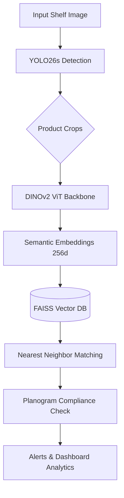

# ShelfMind AI: Smart Retail Shelf Intelligence 🧠🛒

   

ShelfMind AI is an end-to-end, computer vision-driven retail intelligence application. It automatically monitors retail shelves, detects products with high precision, generates planograms, and checks for out-of-stock (OOS) or compliance issues in real-time.

🚀 **Live Deployment**: [Hugging Face Spaces - ShelfMind-AI](https://huggingface.co/spaces/kush5699/ShelfMind-AI-Models)

---

## 🎯 Project Objective

Traditional retail inventory management is manual, error-prone, and slow. ShelfMind AI solves this by leveraging state-of-the-art deep learning architectures to:
1. **Detect** densely packed products on shelves (using a custom-trained **YOLO26s** model).
2. **Recognize** specific products by embedding them into a high-dimensional semantic space (using **DINOv2**).
3. **Monitor Compliance** against expected planograms, identifying misplaced items and calculating the immediate "Revenue at Risk".

---

## 🏗️ Architecture Pipeline

The system uses a two-stage **Detection + Retrieval** pipeline:



---

## 🏆 Benchmark Results on SKU-110K

We trained and evaluated our models on the **SKU-110K** dense retail benchmark (11,762 images, 1.73M annotations, ~147 products/image).

### Comparison with Published Baselines (mAP@50-95)

| # | Model | Type | Backbone | Res. | mAP<sub>50-95</sub> | Params | Source |
|---|-------|------|----------|------|------|--------|--------|
| 1 | Faster R-CNN | Two-stage | ResNet-50 + FPN | 800 | 4.5 | 41M | CVPR'19 [1] |
| 2 | RetinaNet | One-stage | ResNet-50 + FPN | 800 | 45.5 | 37M | CVPR'19 [1] |
| 3 | EM-Merger | One-stage | ResNet-50 + FPN | 800 | 49.2 | ~40M | CVPR'19 [1] |
| 4 | TOOD | Task-aligned | ResNet-50 + FPN | 800 | 51.3 | 32M | ICCV'21 [5] |
| 5 | Cascade R-CNN | Multi-stage | ResNet-101 + FPN | 800 | 52.8 | 69M | CVPR'18 [2] |
| 6 | YOLOv10s | Anchor-free | CSPNet | 640 | 51.2 | 8.0M | NeurIPS'24 [7] |
| | ***Our Experiments*** | | | | | | |
| 7 | YOLO26s v1 | NMS-free | CSPDarknet | 640 | 52.1 | 9.9M | Ours |
| 8 | RF-DETR Base | Transformer | DINOv2 ViT | 560 | 55.5 | 29M | Ours |
| **9** | **YOLO26s v2** | **NMS-free** | **CSPDarknet** | **1280** | **58.3** | **9.9M** | **Ours** |

### Detailed Results (Our Models)

| Model | mAP<sub>50</sub> | mAP<sub>50-95</sub> | Precision | Recall | F1 |
|-------|------|------|-----------|--------|------|
| YOLOv10s [7] | 90.6 | 51.2 | 90.8 | 84.8 | 87.7 |
| YOLO26s v1 (Ours) | 90.2 | 52.1 | 89.5 | 85.5 | 87.4 |
| RF-DETR Base (Ours) | 89.7 | 55.5 | 91.1 | 84.7 | 87.8 |
| **YOLO26s v2 (Ours)** | **91.7** | **58.3** | **91.2** | **87.2** | **89.1** |

*Note: 91.7% mAP@50 represents the practical annotation ceiling of the SKU-110K dataset. TTA, SAHI, and longer training yielded no further gains.*

---

## 💻 Installation

### Prerequisites
- Python 3.11+
- Git

### Setup
1. **Clone the repository:**
   ```bash
   git clone https://github.com/kush5699/ShelfMind-AI.git
   cd ShelfMind-AI
   ```

2. **Install dependencies:**
   ```bash
   pip install -r requirements.txt
   ```

3. **Download Model Weights:**
   The dashboard will automatically download the required `YOLO26s` weights from Hugging Face Hub on the first run. 

---

## 🚀 How to Use

Start the local Streamlit dashboard:

```bash
streamlit run app/dashboard.py
```

### Features:
1. **📸 Product Scanner:** Take photos of individual products to add them to your store's catalog. The app generates a DINOv2 visual embedding for each.
2. **📋 Planogram Creator:** Define the "ideal" shelf layout. Specify how many shelves and what products should go where.
3. **🎥 Live Monitor:** Upload a photo of an actual shelf. The app will detect all products, match them against your catalog, compare them to the planogram, and generate an immediate compliance report.
4. **📊 Analytics:** View historical compliance trends, frequent stockouts, and total revenue at risk.

---

## 📄 License

This project is licensed under the MIT License - see the [LICENSE](LICENSE) file for details.
