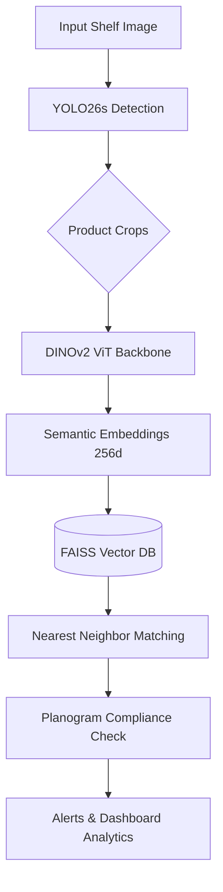

# ShelfMind AI: Smart Retail Shelf Intelligence 🧠🛒

   

ShelfMind AI is an end-to-end, computer vision-driven retail intelligence application. It automatically monitors retail shelves, detects products with high precision, generates planograms, and checks for out-of-stock (OOS) or compliance issues in real-time.

🚀 **Live Deployment**: [Hugging Face Spaces - ShelfMind-AI](https://huggingface.co/spaces/kush5699/ShelfMind-AI-Models)

---

## 🎯 Project Objective

Traditional retail inventory management is manual, error-prone, and slow. ShelfMind AI solves this by leveraging state-of-the-art deep learning architectures to:
1. **Detect** densely packed products on shelves (using a custom-trained **YOLO26s** model).
2. **Recognize** specific products by embedding them into a high-dimensional semantic space (using **DINOv2**).
3. **Monitor Compliance** against expected planograms, identifying misplaced items and calculating the immediate "Revenue at Risk".

---

## 🏗️ Architecture Pipeline

The system uses a two-stage **Detection + Retrieval** pipeline:



---

## 🏆 Training Results

We trained our **YOLO26s** on the heavily dense **SKU-110K** dataset (retail shelf images). 

| Model Version | Resolution | Epochs | mAP50 | mAP50-95 | Inference Speed (CPU) |
|---------------|------------|--------|-------|----------|-----------------------|
| YOLOv10s (Baseline)| 640px | 50 | 0.906 | 0.512 | ~85ms |
| YOLO26s (v1)  | 640px      | 30     | 0.902 | 0.521    | ~72ms                 |
| **YOLO26s (v2)** | **1280px** | **60** | **0.917** | **0.583** | **~110ms** |

*Note: 0.917 mAP50 represents the practical annotation ceiling of the SKU-110K dataset due to labeling ambiguities in highly dense, dark regions.*

---

## 💻 Installation

### Prerequisites
- Python 3.11+
- Git

### Setup
1. **Clone the repository:**
   ```bash
   git clone https://github.com/kush5699/ShelfMind-AI.git
   cd ShelfMind-AI
   ```

2. **Install dependencies:**
   ```bash
   pip install -r requirements.txt
   ```

3. **Download Model Weights:**
   The dashboard will automatically download the required `YOLO26s` weights from Hugging Face Hub on the first run. 

---

## 🚀 How to Use

Start the local Streamlit dashboard:

```bash
streamlit run app/dashboard.py
```

### Features:
1. **📸 Product Scanner:** Take photos of individual products to add them to your store's catalog. The app generates a DINOv2 visual embedding for each.
2. **📋 Planogram Creator:** Define the "ideal" shelf layout. Specify how many shelves and what products should go where.
3. **🎥 Live Monitor:** Upload a photo of an actual shelf. The app will detect all products, match them against your catalog, compare them to the planogram, and generate an immediate compliance report.
4. **📊 Analytics:** View historical compliance trends, frequent stockouts, and total revenue at risk.

---

## 📄 License

This project is licensed under the MIT License - see the [LICENSE](LICENSE) file for details.
